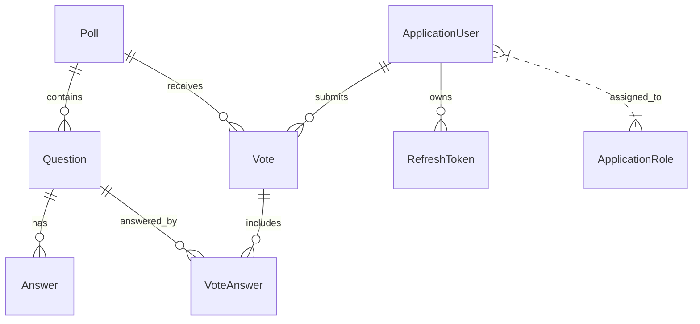

# Survey Basket 📝 (ASP.NET Core Web API)

Survey Basket is a simple and efficient survey management system for creating, sharing, and analyzing polls. It supports user authentication, role-based permissions, and automated notifications, making it suitable for organizations or teams that need to collect and manage feedback easily.

> **Note:** Survey Basket is designed for straightforward survey workflows, focusing on ease of use, security, and reliable performance.

---

## 🚀 Project Vision

Survey Basket aims to provide a lightweight backend for survey management, enabling:

- Creating and managing polls with multiple questions and answers
- Collecting and tracking user responses
- Role-based access for admins and regular users
- Automated email notifications for new polls
- Secure authentication and user management

---

## 🛡️ Professional Features

Survey Basket includes essential modules and best practices for a modern web API:

- **User Management**: Registration, login, JWT authentication, and role-based permissions
- **Poll & Question Management**: CRUD operations for polls, questions, and answers
- **Response Tracking**: Collect and analyze user votes and poll results
- **Structured Logging**: Centralized logs using Serilog for monitoring and debugging
- **Exception & Error Handling**: Consistent error responses and global exception management
- **Background Jobs**: Automated email notifications for new polls using Hangfire
- **Validation**: FluentValidation for robust server-side validation
- **Security**: ASP.NET Core Identity, JWT, and role-based authorization
- **Repository & Unit of Work Pattern**: Clean, testable data access
- **API Versioning**: Support for multiple API versions
- **Health Checks**: Endpoints for monitoring application and database health
- **Rate Limiting**: Protects APIs from abuse and accidental overload

---

## 🗄️ Database Design

### **Core Entities**

| Entity           | Description                                 | Status      |
| ---------------- | ------------------------------------------- | ----------- |
| ApplicationUser  | System users (admin, user)                  | Implemented |
| Poll             | Survey poll with title, summary, dates      | Implemented |
| Question         | Questions belonging to a poll               | Implemented |
| Answer           | Possible answers for each question          | Implemented |
| Vote             | User's response to a poll                   | Implemented |
| VoteAnswer       | Selected answer for a question in a vote    | Implemented |
| ApplicationRole  | User roles (admin, user)                    | Implemented |
| RefreshToken     | For secure JWT refresh                      | Implemented |

---

### **Entity Relationship Diagram (Simplified)**



---

## 📦 Project Structure

```
SurveyBasket/
├── Abstractions/         # Core interfaces and result pattern
├── Authentication/       # JWT, Identity, and auth logic
├── Contracts/            # DTOs and validation
├── Controllers/          # API endpoints
├── Entities/             # Database models
├── Errors/               # Error handling
├── Extensions/           # Helper extensions
├── Health/               # Health checks
├── Helpers/              # Utility classes
├── Mapping/              # Mapster configurations
├── Persistence/          # DbContext, migrations, configs
├── Services/             # Business logic and background jobs
├── Settings/             # App and mail settings
├── Templates/            # Email templates
├── Program.cs            # App entry point
├── DependencyInjection.cs # Service registration
└── ...
```

---

## 🛠️ Technologies Used

**Backend & Core:**
- ASP.NET Core (Web API)
- Entity Framework Core (SQL Server)
- ASP.NET Core Identity (role-based auth)
- Hangfire (background jobs)
- Serilog (logging)
- Mapster (object mapping)
- FluentValidation (validation)
- Repository & Unit of Work Pattern
- Result Pattern
- Clean Architecture principles

**Other Integrations:**
- MailKit (email sending)
- OpenAPI/Swagger (API docs)
- Rate Limiting (Microsoft.AspNetCore.RateLimiting)
- HealthChecks (AspNetCore.HealthChecks)
- Hybrid Caching (Microsoft.Extensions.Caching.Hybrid)
- API Versioning (Asp.Versioning)
- CORS
- OneOf (discriminated unions)
- System.Linq.Dynamic.Core
- Scalar.AspNetCore

---

## ⚡ Getting Started

1. **Clone the repository:**
   ```bash
   git clone <your-repo-url>
   cd SurveyBasket
   ```
2. **Configure your database connection:**
   - Edit `SurveyBasket/appsettings.json` with your SQL Server details.
3. **Restore dependencies:**
   ```bash
   dotnet restore
   ```
4. **Run EF Core migrations:**
   ```bash
   dotnet ef database update
   ```
5. **Start the application:**
   ```bash
   dotnet run --project SurveyBasket
   ```
6. **Access the API:**
   - Browse to [https://localhost:5001/swagger](https://localhost:5001/swagger) (or as configured).

---

## 📝 Roadmap

- [x] User authentication & roles
- [x] Poll, question, and answer management
- [x] Voting and result tracking
- [x] Email notifications for new polls
- [x] Logging & error handling
- [x] Health checks & rate limiting
- [x] API versioning
- [ ] Docker support (future)
- [ ] Unit & integration tests (future)

---

## 🤝 Contributing

- Fork the repository and create feature branches.
- Follow .NET coding conventions and ensure code is well-documented.
- Write or extend unit/integration tests as needed.
- Submit clear and descriptive pull requests.

---

## 📄 License

This project is licensed under MIT.

---

## 📫 Contact

- **GitHub:** [OmarDiv](https://github.com/OmarDiv)
- **Email:** [Omaar88mohamed@example.com](mailto:Omaar88mohamed@example.com)

---

_Survey Basket is an independent project and not affiliated with any company or organization._

---
